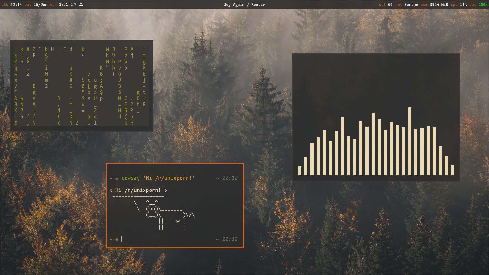

# My semi-minimalistic dotfiles for Arch Linux



## Overview
- Gruvbox theme
- Hyprland
- Kitty
- Waybar
- Sway Notification Centre
- Syshud volume and brightness OSD
- Wofi
- Neovim
- Zsh
- Custom scripts
- Fully themed terminal and WM

## Install
Hi there, if you have just installed these dotfiles, please install the following applications:

```shell
sudo pacman -Syu base-devel bat blueman-manager brightnessctl eza feh firefox fastfetch fzf gammastep git hyprland hyprlock hyprlock hyprpicker kitty lazygit libnotify luarocks minizip neovim nm-connection-editor npm nwg-look pavucontrol playerctl qt5-wayland qt6-5compat qt6-shadertools qt6-wayland ripgrep starship swaync swww trash-cli ttf-droid ttf-font-awesome ttf-ibm-plex ttf-jetbrains-mono ttf-jetbrains-mono-nerd ttf-mononoki-nerd ttf-nerd-fonts-symbols typescript unzip waybar wl-clipboard wofi xdg-desktop-portal-gtk xdg-desktop-portal-hyprland xdg-desktop-portal-wlr yazi zoxide
```

For the full experience also install the extras:
```shell 
vlc mpv evince obs-studio spotify-launcher obsidian bitwarden wf-recorder yt-dlp wireguard-tools syncthing qbittorrent decoder discord
```

Make sure you have an AUR helper installed like [paru](https://github.com/Morganamilo/paru?tab=readme-ov-file#installation) or [yay](https://github.com/Jguer/yay?tab=readme-ov-file#installation). Don't know the difference? Choose yay, it sounds happier :).

For AUR stuff install the following:
```shell
yay -S clipse-bin syshud bibata-cursor-theme-bin waypaper arcolinux-logout gruvbox-dark-gtk hyprshot spicetify-cli stremio topgrade-bin
paru -S clipse-bin syshud bibata-cursor-theme-bin waypaper arcolinux-logout gruvbox-dark-gtk hyprshot spicetify-cli stremio topgrade-bin
```
