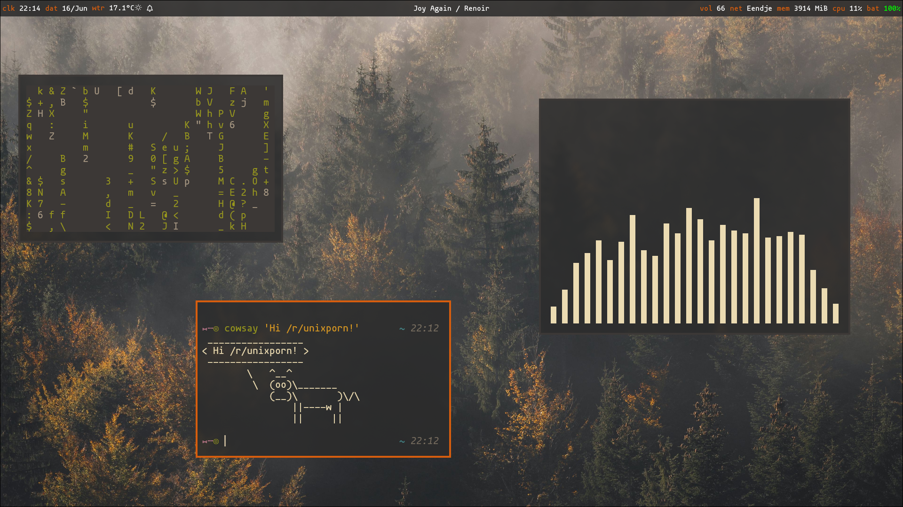
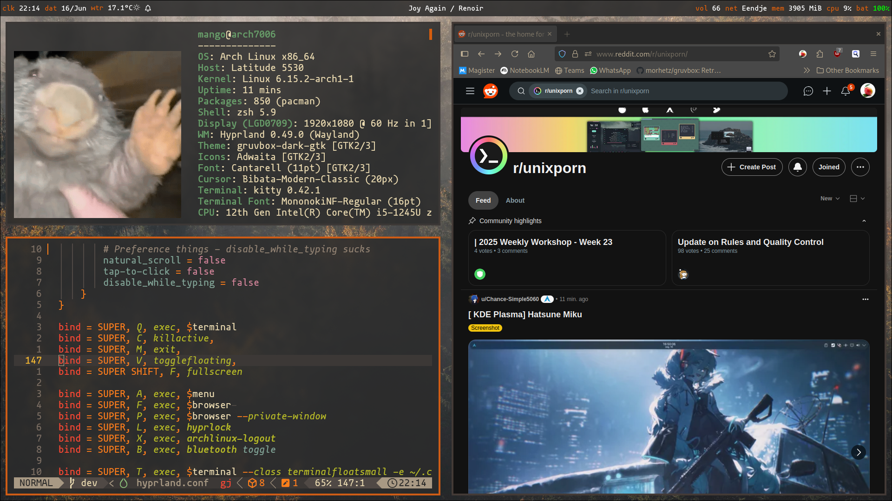
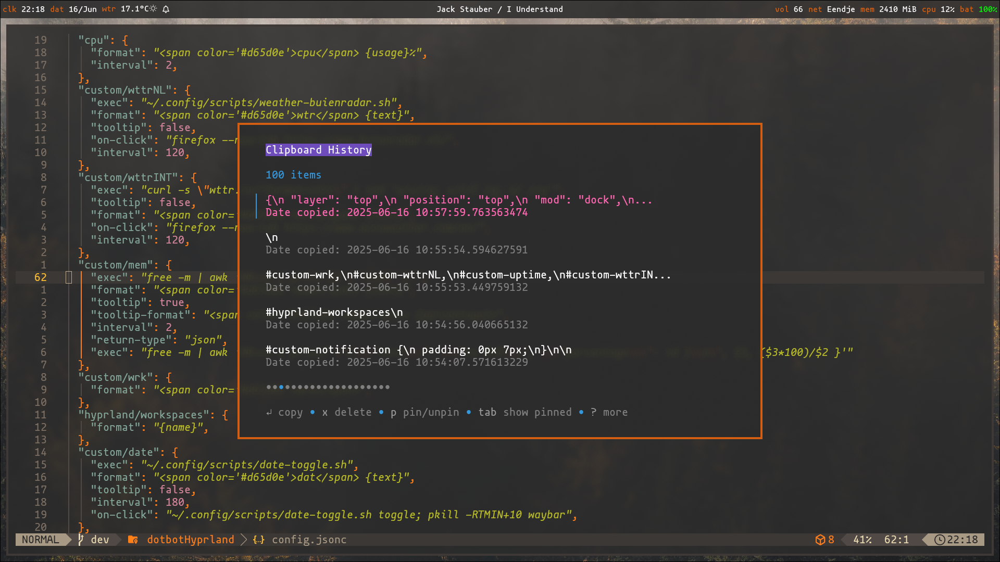
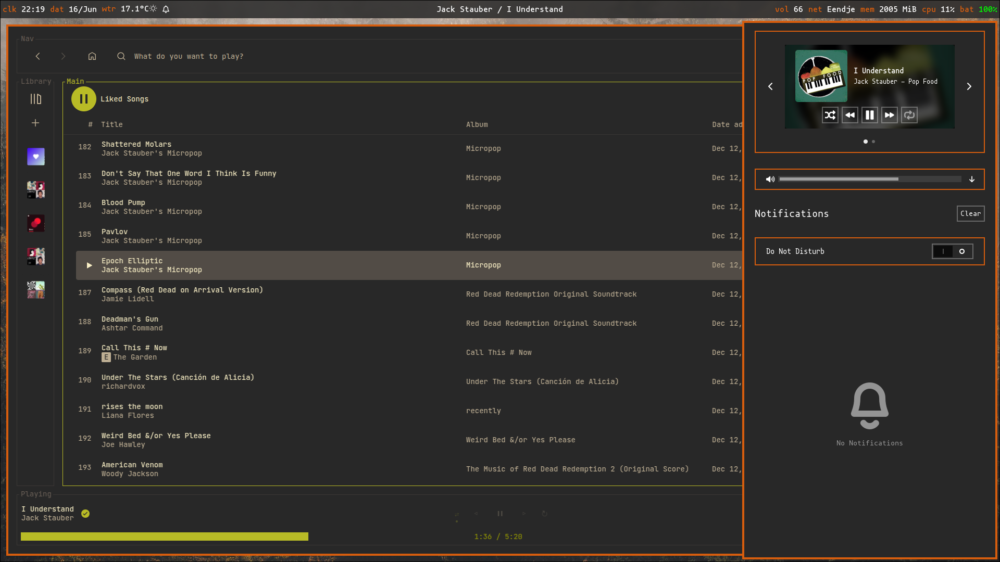
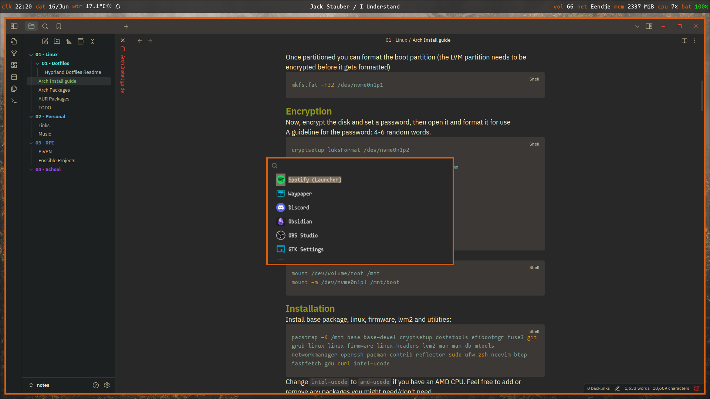

# My semi-minimalistic dotfiles for Arch Linux



## Overview
- Gruvbox theme
- Hyprland
- Kitty
- Waybar
- Sway Notification Centre
- Wofi
- Neovim
- Zsh
- Custom scripts
- Fully themed terminal and WM

Disclaimer: 
These dotfiles are meant for Arch Linux and are tailored to my laptop.
They might not work correctly on your machine.
These dotfiles are meant for Hyprland, but with minimal config you could probably make it work wherever on wayland (maybe even X11!).
Also some of these scripts have local IP's and MAC addresses, these are worthless to anyone but me so don't forget to change those.
ps. at the end I will put the things to change for you :)

## Install
### Using dotbot:
*BEWARE, THIS REMOVES THE OLD FILES, MAKE SURE YOU HAVE A BACKUP*
```shell
git clone https://mango7006/dotbotHyprland.git
cd dotbotHyprland
./install
```
### Manually
```shell
git clone https://mango7006/dotbotHyprland.git
```
Then just use `cp` to copy the files to the right destination, for example:
```shell
cp -r hypr ~/.config/hypr
```
### Dependencies
```shell
sudo pacman -Syu base-devel bat blueman-manager brightnessctl curl eza feh firefox fastfetch fzf gammastep git hyprland hyprlock hyprlock hyprpicker kitty lazygit libnotify luarocks minizip neovim nm-connection-editor npm nwg-look pavucontrol playerctl qt5-wayland qt6-5compat qt6-shadertools qt6-wayland ripgrep starship swaync swww trash-cli ttf-droid ttf-font-awesome ttf-ibm-plex ttf-jetbrains-mono ttf-jetbrains-mono-nerd ttf-mononoki-nerd ttf-nerd-fonts-symbols typescript unzip waybar wl-clipboard wofi xdg-desktop-portal-gtk xdg-desktop-portal-hyprland xdg-desktop-portal-wlr yazi zoxide wakeonlan moonlight-qt
```

For the full experience also install the extras:
```shell 
vlc mpv spotify-launcher obsidian bitwarden wf-recorder yt-dlp wireguard-tools syncthing discord
```

Make sure you have an AUR helper installed like [paru](https://github.com/Morganamilo/paru?tab=readme-ov-file#installation) or [yay](https://github.com/Jguer/yay?tab=readme-ov-file#installation). Don't know the difference? Choose yay, it sounds happier :).

For AUR stuff install the following:
```shell
yay -S clipse-bin bibata-cursor-theme-bin waypaper arcolinux-logout gruvbox-dark-gtk hyprshot spicetify-cli stremio topgrade-bin
paru -S clipse-bin bibata-cursor-theme-bin waypaper arcolinux-logout gruvbox-dark-gtk hyprshot spicetify-cli stremio topgrade-bin
```
## More Screenshots






## Personal wifi names, interfaces, IP's, etc...
1. In `config/hypr/hyprland.conf` I call a wireguard script at start - you might not need this, or have a different interface name than `wg0`, edit `config/scripts/options.conf` to your liking.
2. In `home/.zshrc` there are aliases setup for specific internal IP's and MAC addresses. Just delete or change them.
3. Also in `home/.zshrc` under zstyle you have to change the path to your own username.
4. If you do not live in the Netherlands you will have to edit `config/waybar/config.jsonc` to use the international weather module and not the Dutch one. (Just uncomment the wttrINT module and comment the wttrNL module)
5. In `config/scripts/wake-pc.sh` there is a MAC address, change it.

## If you want to use another WM (maybe X11?)
1. First off throw the hyprland conf out of the window (except maybe the wallpapers, they are nice)
2. In whatever WM you will be using make sure you have `terminalfloat` and `terminalfloatsmall` classes set as floating and centered (look at current config for the values)
3. In `config/waybar/config.jsonc` there are only two Hyprland only modules; `hyprland/workspaces` and `keyboardHypr`. For `hyprland/workspaces` just search the equivalent and change, and keyboardHypr, idk (good luck tho!)
4. `config/scripts/focus-mode.sh` is completely worthless without Hyprland
5. `config/scripts/actions-menu.sh` also has Hyprctl keyboard switcher so also no-no there.
